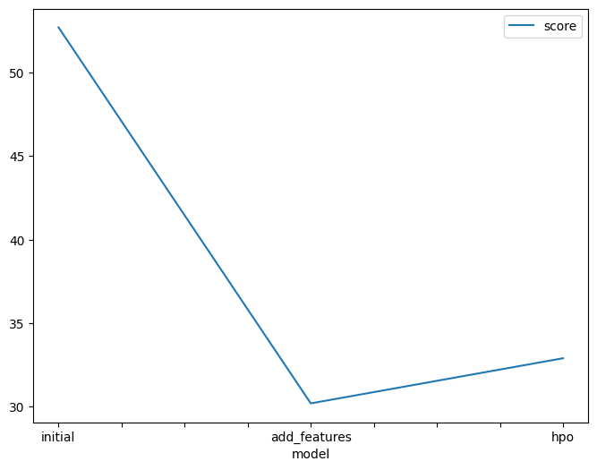
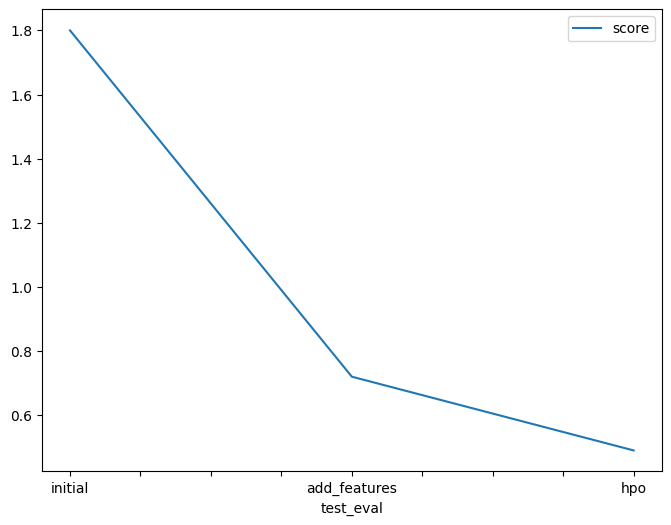

# Report: Predict Bike Sharing Demand with AutoGluon Solution

#### Qudus Abolade

## Initial Training

### What did you realize when you tried to submit your predictions? What changes were needed to the output of the predictor to submit your results?

When I first submitted the project without any analysis or feature engineering, I did not encounter any errors. My submission
did not include any negative values. However, the model performed poorly.

### What was the top ranked model that performed?

The top ranked model that performed was the WeightedEnsemble_L3

## Exploratory data analysis and feature creation

### What did the exploratory analysis find and how did you add additional features?

I first found that the temp and atemp were highly correlated, so I removed atemp. I found that the datetime was recorded on an hourly basis. So I split it into day, month, year, and hour. I also changed the data types of some variables to categorical.

### How much better did your model preform after adding additional features and why do you think that is?

A lot better. The error reduced by a lot. I think this is because the model was able to learn more from the data.

## Hyper parameter tuning

### How much better did your model preform after trying different hyper parameters?

The model improved but not by a lot. I think this is because the model was already performing well. Or maybe becasue I have not found the right parameters to use yet.

### If you were given more time with this dataset, where do you think you would spend more time?

I would spend more time on the hyperparameter tuning. I would also try to add more features. I think I would also spend more time analysing and further seperating the data.

### Create a table with the models you ran, the hyperparameters modified, and the kaggle score

|model|hpo1|hpo2|hpo3|score|
|--|--|--|--|--|
|initial|default_values|default_values|default_values|1.80|
|add_features|default_values|default_values|default_values|0.72|
|hpo|GBM: num_leaves: lower=26, upper=66|XGB: max_depth lower=5, upper=9|refit_full='best'|0.49|

### Create a line plot showing the top model score for the three (or more) training runs during the project

### Create a line plot showing the top kaggle score for the three (or more) prediction submissions during the project

## Summary

In summary, for this project, I used all concepts taught in the first lesson. I used AutoGluon to train a model to predict the number of bikes that will be rented in a given hour. I first submitted the project without any analysis or feature engineering. The model performed poorly. I was able to improve the model by adding more features and tuning the hyperparameters. I was able to reduce the error from 1.80 to 0.49.
